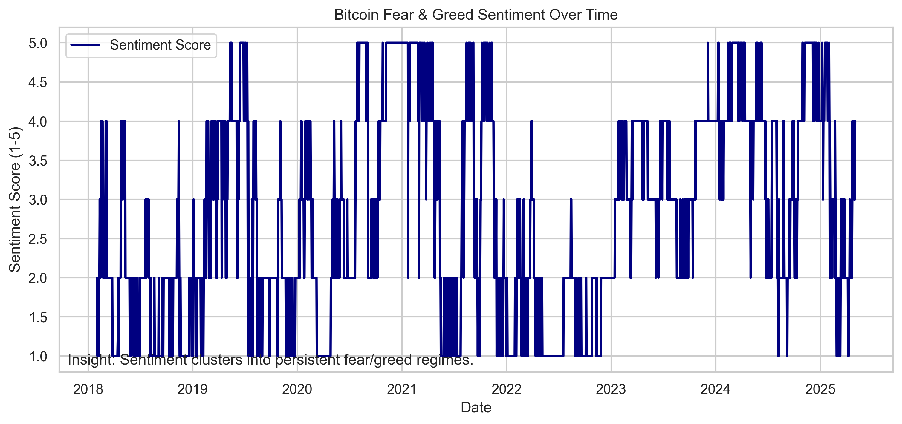
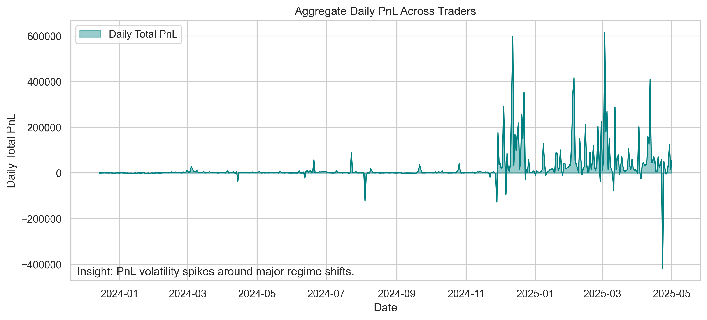
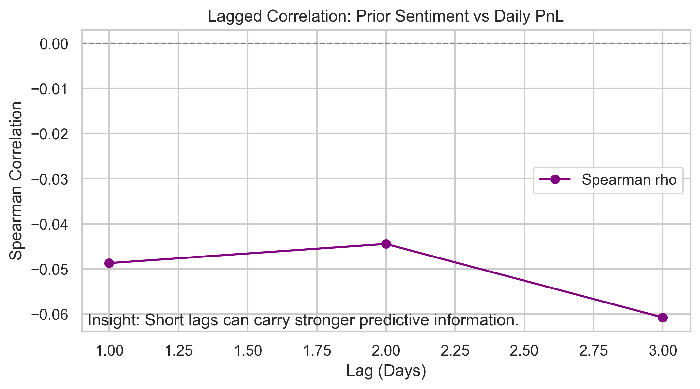

# Bitcoin Trader Behavior & Market Sentiment Analysis

## Project Overview

This project analyzes how Bitcoin market sentiment (Fear & Greed Index) relates to Hyperliquid trader behavior and outcomes.

It provides a production-style, end-to-end workflow:

1. Load and clean sentiment and trade-level data.
2. Engineer performance and risk features.
3. Merge trades with daily sentiment regimes.
4. Run EDA, hypothesis tests, clustering, lag analysis, and smart-money comparisons.
5. Generate reproducible figures and a final insights report.

## Repository Structure

```text
trader-sentiment-analysis/
├── data/
│   ├── raw/
│   │   ├── hyperliquid_trades.csv
│   │   └── fear_greed_index.csv
│   └── processed/
│       ├── merged_dataset.csv
│       ├── daily_summary.csv
│       ├── sentiment_summary.csv
│       ├── fear_greed_diagnostics.csv
│       └── quarantined_records.csv
├── notebooks/
│   ├── 01_data_loading_and_cleaning.ipynb
│   ├── 02_eda_fear_greed.ipynb
│   ├── 03_eda_trader_performance.ipynb
│   ├── 04_sentiment_vs_performance_analysis.ipynb
│   ├── 05_pattern_discovery.ipynb
│   └── 06_insights_and_strategy.ipynb
├── src/
│   ├── data_loader.py
│   ├── preprocessing.py
│   ├── feature_engineering.py
│   ├── analysis.py
│   └── visualizations.py
├── outputs/
│   ├── figures/
│   └── reports/
│       └── final_insights_report.md
├── requirements.txt
├── README.md
└── main.py
```

## Setup

1. Create and activate a Python environment.
2. Install dependencies:

```bash
pip install -r requirements.txt
```

1. Ensure raw data files exist in `data/raw/`:
   - `fear_greed_index.csv`
   - `hyperliquid_trades.csv`

## Run Full Pipeline

```bash
python main.py
```

This command will:

1. Clean and merge datasets.
2. Save processed outputs to `data/processed/`.
3. Generate key figures in `outputs/figures/`.
4. Print statistical summary metrics to the console.

## Notebook Execution Order

1. `01_data_loading_and_cleaning.ipynb`
2. `02_eda_fear_greed.ipynb`
3. `03_eda_trader_performance.ipynb`
4. `04_sentiment_vs_performance_analysis.ipynb`
5. `05_pattern_discovery.ipynb`
6. `06_insights_and_strategy.ipynb`

## Key Findings Summary

1. Performance differs significantly across sentiment regimes: Kruskal-Wallis $H=1226.9956$, $p=2.238\times10^{-264}$.
2. Daily win rate rises with sentiment score: Spearman $\rho=0.1610$, $p=0.000404$.
3. Average leverage falls as sentiment score rises: Spearman $\rho=-0.1124$, $p=0.0138$.

## Embedded Chart Preview







## Reproducibility Notes

1. Random seeds are fixed to `42` where random algorithms are used.
2. Cleaning logic quarantines impossible records (for example, non-positive size/price).
3. Statistical tests include non-parametric methods (Kruskal-Wallis, Spearman) suitable for heavy-tailed returns.

## Deliverables

1. Modular source code in `src/`.
2. Six assignment-aligned notebooks in `notebooks/`.
3. Final report in `outputs/reports/final_insights_report.md`.
4. End-to-end script in `main.py`.
